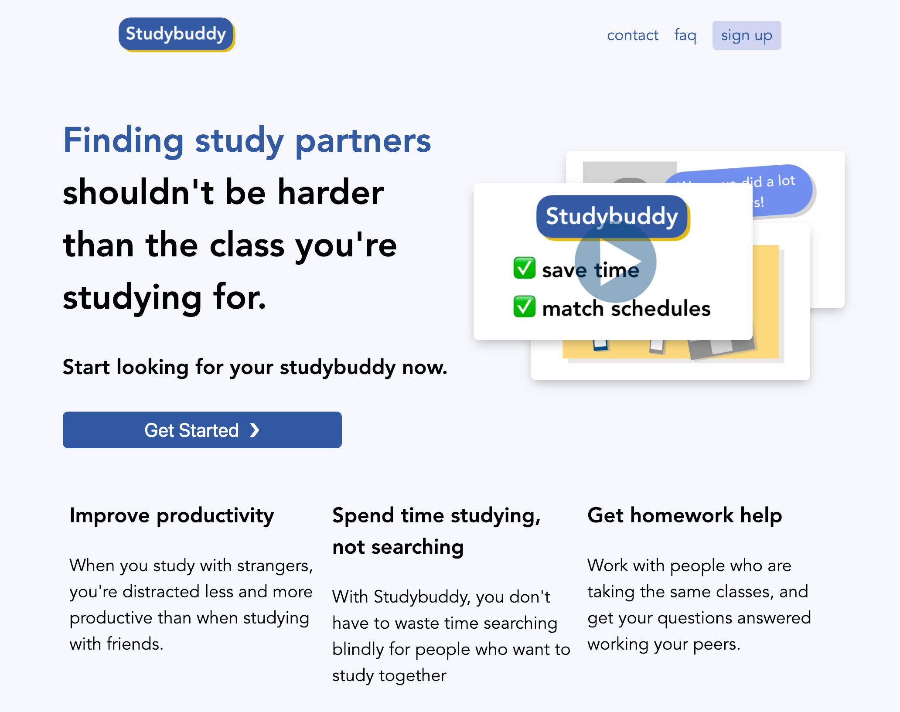

# Studybuddy

Studybuddy helps university students find classmates to study with.



Studybuddy is still in the alpha phase, and is more a proof of concept and less a production app. Lots of things are not scalable, and lots of things are changing pretty rapidly (including the database schema, which is why we roll custom for now).

## Setup and installation

Studybuddy is a Nodejs and Express app. To run your own instance:

1. Clone the repository: `git clone https://github.com/thesephist/gemini.git`
2. Install NPM dependencies. If you use yarn, you can run `yarn install` to install based on the provided lockfile. Otherwise, `npm install` will work just fine.
3. The app needs a `secrets.js` file in the root folder of the project with configuration variables to do some of its authentication / email automation magic. Here's a breakdown of an example:
    ```js
    // secrets.js

    module.exports = {
        // Domain at which the app runs.
        // This will be used to redirect from Google's authentication page
        AUTH_HOST: 'http://localhost:5050',

        // Authentication redirect URL path. `/auth/google/redirect` should work just fine.
        AUTH_REDIRECT_URL: '/auth/google/redirect',

        // Google OAuth API keys
        // You can get these keys at Google Developer Console by creating a new app
        CLIENT_ID: '<put your OAuth API key here>.apps.googleusercontent.com',
        CLIENT_SECRET: '<put your secret key here>',

        // This is a random , persistent key used to generate cookies used
        //  in the authentication process. Pick any sufficiently random string.
        COOKIE_KEY: '<your cookie key>',

        // Mailgun API keys -- get them at mailgun.com for free (with a domain)
        //  These keys aren't needed for you to use the rest of the app, but
        //  having incorrect keys will make your email requests error in production.
        MG_DOMAIN: '<your mailgun domain>',
        MG_API_KEY: '<your mailgun API key>',

        // If you're running a development version, setting this to true
        //  will disable real emails from being sent during testing.
        // This is `false` by default.
        DEVELOPMENT: true,
    }
    ```
4. Start the app with `yarn start` or `npm start`!

The app should persist database data to `/db/db.json` and session data to `/db/sessions/` by default. Modify them in `config.js` to change them.

## Contributing

If you'd like to contribute new features, file bugs, or implement some of the TODO features above, please fele free to put in a PR or file an issue!

TODOs and planned features and bugfixes can be found at `TODOS.md`.
